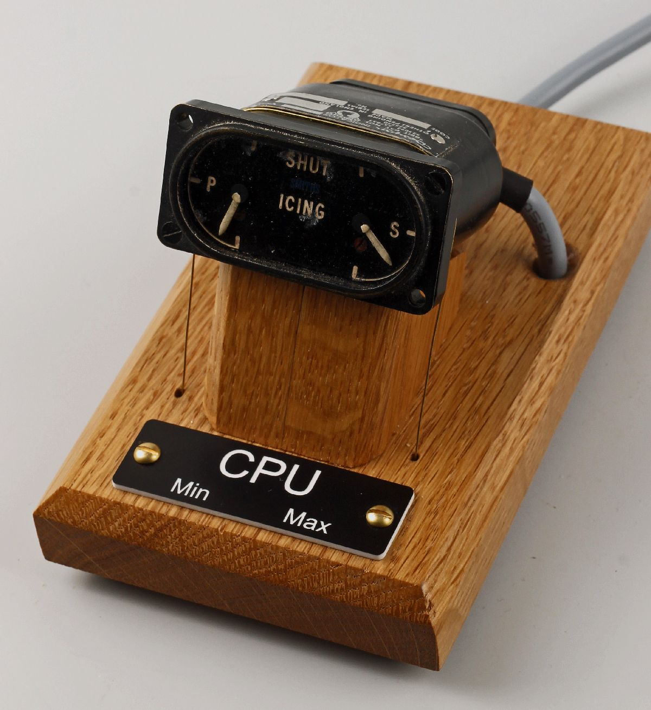
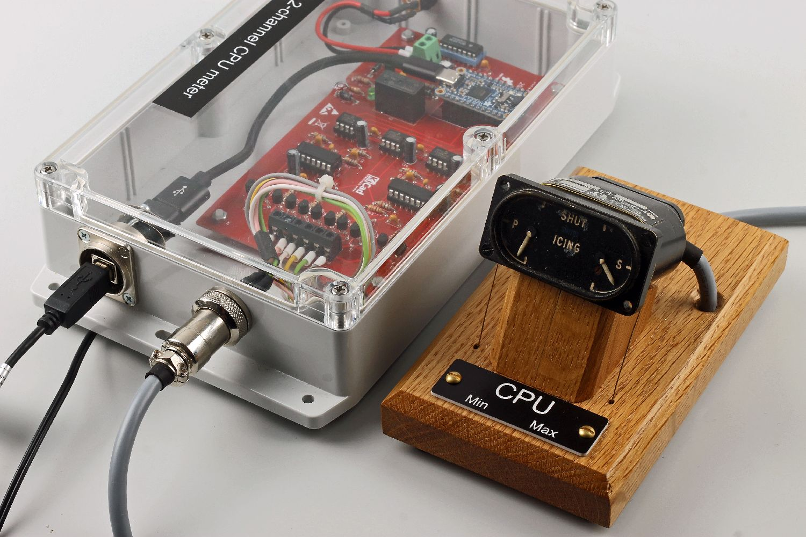
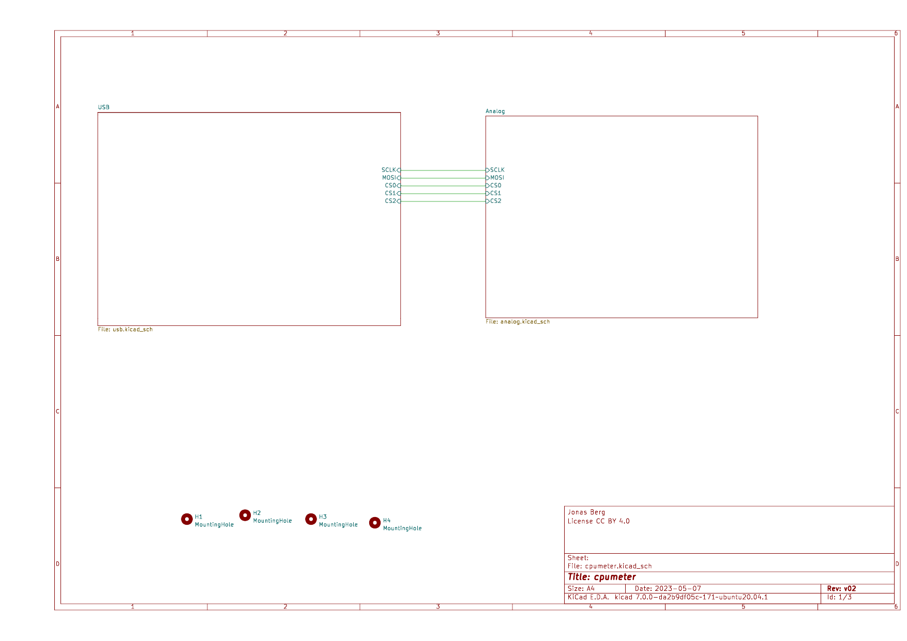
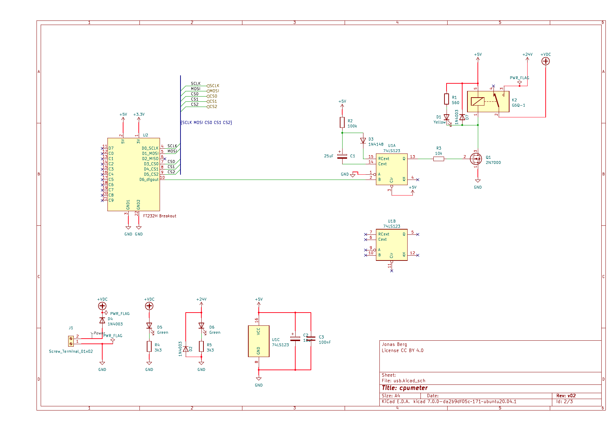
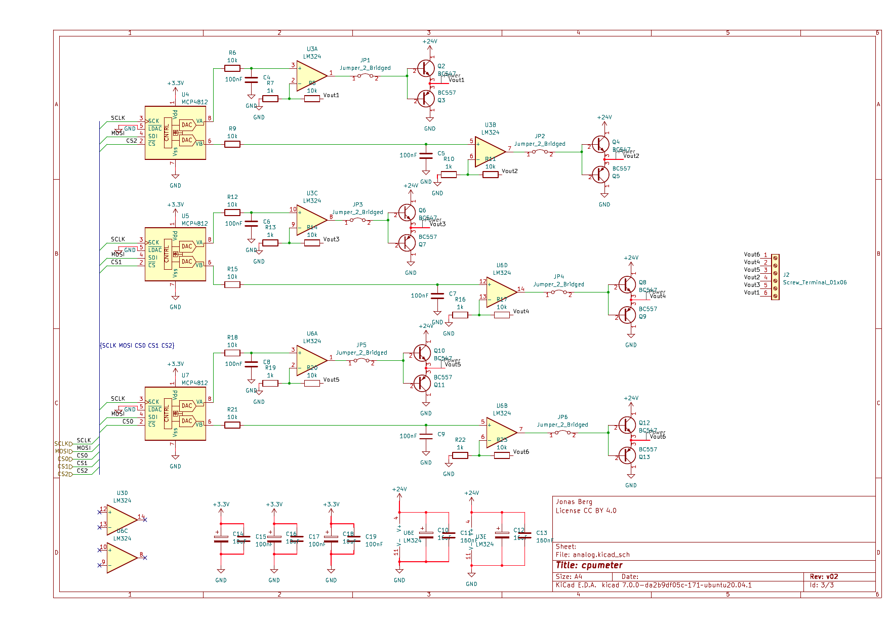
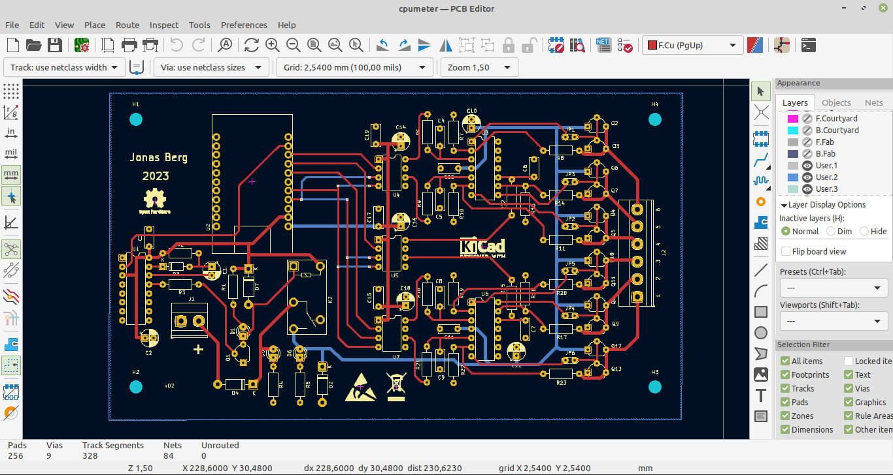
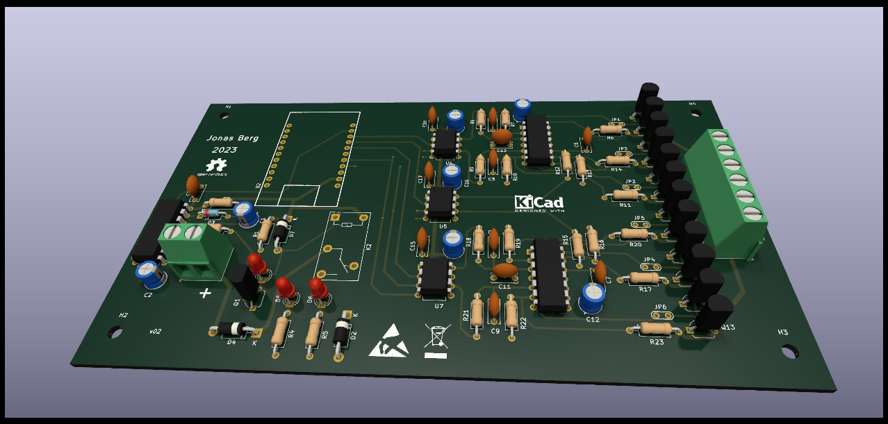
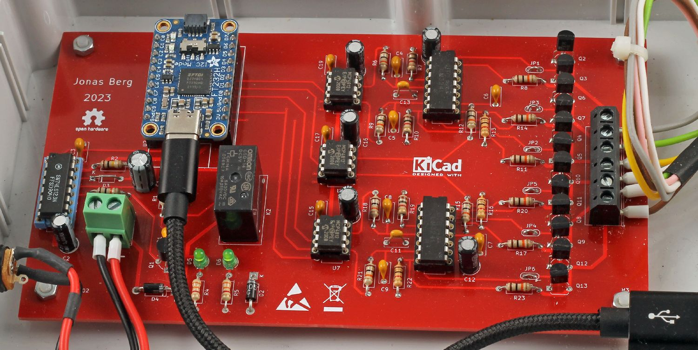

# CPU meter from an old Desynn avionics instrument



Show the min and max utilisation of the CPU cores in your laptop. Connect via USB!




https://github.com/pyhys/cpumeter/assets/1586574/bd168bb1-08ae-4780-b7be-f264444b6949


Original indicator use in for example Hawker Hunter
---------------------------------------------------
Several variants with different labels

https://en.wikipedia.org/wiki/Hawker_Hunter

External view
https://www.jetphotos.com/photo/10868031

Cockpit photo
https://www.jetphotos.com/photo/9365230


Circuit design
--------------
Six voltages 0-24 V

DAC for analog outputs variant?

Amplifier 0-2 V to 0-24 V variant?

Power amplifiers (voltage followers) transistors ?

Timer circuit monostable 74LS123

USB-to-SPI

FT232H
https://ftdichip.com/products/ft232hq/

Adafruit Breakout board
https://www.adafruit.com/product/2264

Here is the resulting schematics:






PCB design
----------
Kicad https://www.kicad.org/






Software
--------
Written in Python

Autostart with udev and systemd


Installation
------------

Install the Python dependencies so they are available for the root user.

```
sudo mkdir /opt/cpumeter
sudo cp src/cpumeter.sh /usr/local/bin/cpumeter
sudo cp src/cpumeter_daemon.py /opt/cpumeter/
sudo cp src/95-cpumeter.rules /etc/udev/rules.d/
sudo cp src/cpumeter.service /etc/systemd/system/
```

udev
----
```
sudo udevadm control --reload
udevadm trigger
udevadm monitor
udevadm monitor --property
udevadm monitor --env
```

Start or stop the daemon
------------------------
```
sudo systemctl daemon-reload
sudo systemctl restart cpumeter.service
sudo systemctl stop cpumeter.service
```

Show log file
-------------
```
sudo systemctl status cpumeter.service
journalctl -u cpumeter.service
journalctl -u cpumeter.service -f
```

Indicator working principle
---------------------------
Smiths desynn

See http://avionicengineer.blogspot.com/2011/03/synchronous-data-transmission.html

Discussion on https://www.youtube.com/watch?v=2iqJ6352u74


